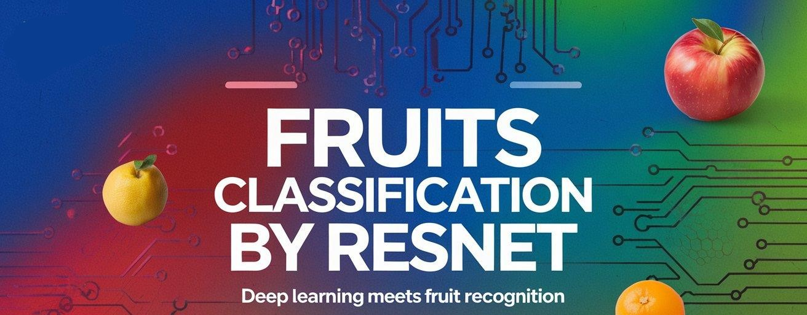

# Fruits Classification by ResNet 🍏🍊




[](https://www.python.org/)
[](LICENSE)

## Overview 🚀
**Fruits Classification by ResNet** is an end-to-end deep learning project that leverages transfer learning with a pre-trained ResNet model to accurately classify fruit images. This project covers data loading, preprocessing, model building, training, evaluation, and real-time inference—all in one comprehensive workflow.

## Project Objectives 🎯
- **Accurate Classification:** Distinguish between various fruit types using a deep learning approach.
- **Efficient Transfer Learning:** Utilize a pre-trained ResNet model to boost performance and reduce training time.
- **Robust Data Handling:** Implement comprehensive data preprocessing and augmentation.
- **Comprehensive Evaluation:** Assess model performance through multiple metrics and visualizations.
- **Scalable Inference:** Provide a framework for real-time fruit classification and deployment.

## Technologies & Techniques ⚙️
- **Deep Learning & Transfer Learning:** Pre-trained ResNet models (e.g., ResNet-50) for robust feature extraction.
- **Convolutional Neural Networks (CNNs):** Utilize convolutional layers to automatically learn image features.
- **Data Augmentation:** Techniques such as rotations, flips, scaling, and cropping to enhance dataset variability.
- **Optimization Algorithms:** Employ the Adam optimizer for adaptive learning during training.
- **Regularization & Callbacks:** Implement early stopping, learning rate scheduling, and dropout to prevent overfitting.
- **Visualization Tools:** Use Matplotlib for plotting training progress and performance metrics.

## Installation 💻

1. **Clone the Repository:**
        ```
        git clone https://github.com/yourusername/fruits-classification-by-resnet.git
        cd fruits-classification-by-resnet
        ```

2. **Create a Virtual Environment (optional but recommended):**

        python -m venv venv
        source venv/bin/activate  # On Windows: venv\Scripts\activate

3. **Install Dependencies:**

        pip install -r requirements.txt

4. **Download or Place the Dataset:**
   - Ensure the fruit image dataset is available in the expected directory structure as outlined in the project documentation.

## Usage 🚀

- **Training the Model:**
  - Open and run the Jupyter Notebook `fruits-classification-by-resnet.ipynb` to start the training process.
  - The notebook covers all steps from data loading and preprocessing to model training and evaluation.

- **Inference:**
  - Use the provided inference code snippet within the notebook to load the trained model and classify new fruit images in real time.

## Project Structure 📂

    fruits-classification-by-resnet/
    ├── data/                   # Dataset folder (images and labels)
    ├── notebooks/              # Jupyter notebooks for training and evaluation
    │   └── fruits-classification-by-resnet.ipynb
    ├── requirements.txt        # Python dependencies
    ├── README.md               # This file
    └── LICENSE                 # License file (MIT)

## Full Source Code 💻

    # Check out the Python Notebook `fruits-classification-by-resnet.ipynb`

## Conclusion & Future Work 🎉
This project demonstrates the power of transfer learning with ResNet for fruit classification:
- **Key Takeaways:**
  - Effective use of pre-trained models to accelerate deep learning tasks.
  - The importance of data augmentation and robust preprocessing.
  - Comprehensive evaluation methods to ensure high model performance.
- **Future Enhancements:**
  - Experiment with alternative architectures (e.g., DenseNet, EfficientNet).
  - Integrate advanced augmentation strategies.
  - Optimize the model for faster real-time inference and deploy in a user-friendly interface.

## License
This project is licensed under the [MIT License](LICENSE). Feel free to use and modify it as needed.

Happy coding and fruit classifying! 🍎🤖✨
